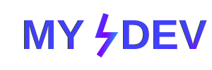

# MYDEV

<p align="center">
  
</p>

Este é um projeto baseado no [bolt.diy](https://github.com/stackblitz-labs/bolt.diy), uma ferramenta que permite criar, executar, editar e implantar aplicativos web full-stack usando qualquer LLM (Large Language Model) de sua escolha.

## Sobre este projeto

MYDEV é uma plataforma de desenvolvimento avançada baseada no bolt.diy, mas com uma identidade própria e melhorias específicas. O projeto foi criado para oferecer uma experiência de desenvolvimento mais intuitiva e poderosa, mantendo as funcionalidades principais do bolt.diy enquanto adiciona recursos personalizados:

- **Desenvolvimento Acelerado**: Ambiente web full-stack com NodeJS diretamente no navegador
- **IA Avançada**: Suporte para mais de 19 LLMs com arquitetura extensível e personalizada
- **Compreensão Visual**: Anexar imagens aos prompts para melhor entendimento contextual
- **Terminal Inteligente**: Terminal integrado com histórico e sugestões avançadas
- **Controle de Versão**: Sistema aprimorado para reverter código e comparar versões
- **Portabilidade**: Baixar projetos como ZIP com estrutura otimizada
- **Containerização**: Suporte a Docker com configurações pré-otimizadas
- **Implantação Simplificada**: Deploy direto para Netlify, Vercel ou GitHub Pages
- **Experiência Desktop**: Aplicativo Electron com recursos nativos adicionais
- **Análise de Dados**: Ferramentas avançadas de visualização e processamento
- **Integração Git**: Sistema de controle de versão aprimorado
- **Protocolo MCP**: Suporte avançado ao Model Context Protocol
- **Busca Inteligente**: Funcionalidade de pesquisa no código com sugestões contextuais
- **Colaboração**: Sistema de bloqueio de arquivos para trabalho em equipe
- **Comparação Visual**: Visualização de diferenças com destaque sintático
- **Backend Integrado**: Integração aprimorada com Supabase
- **Mobile**: Criação de aplicativos Expo para React Native com templates exclusivos

## Como começar

1. Clone o repositório:
   ```bash
   git clone https://github.com/leoaalvsufg/MYDEV.git
   ```

2. Instale as dependências:
   ```bash
   npm install --legacy-peer-deps
   ```

3. Execute o projeto em modo de desenvolvimento:
   ```bash
   npm run dev
   ```

## Identidade Visual

O MYDEV possui uma identidade visual própria, com um logotipo moderno que representa a fusão entre desenvolvimento e inteligência artificial. As cores gradientes do azul ao roxo simbolizam a versatilidade e inovação da plataforma.

## Contribuição

Contribuições são bem-vindas! Sinta-se à vontade para abrir issues ou enviar pull requests para melhorar o MYDEV.

## Licença

Este projeto está licenciado sob a licença MIT - veja o arquivo LICENSE para mais detalhes.

## Agradecimentos

- Agradecemos ao projeto [bolt.diy](https://github.com/stackblitz-labs/bolt.diy) por fornecer a base para o MYDEV.
- A todos os contribuidores que ajudaram a tornar este projeto possível.